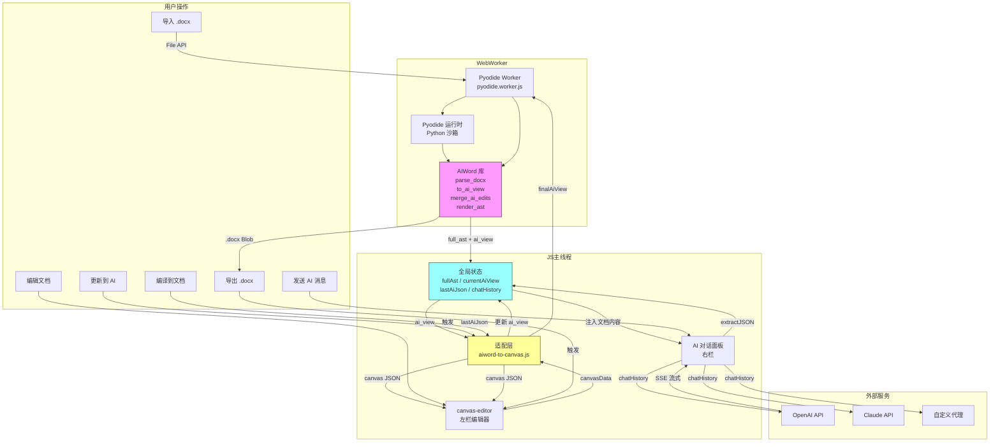
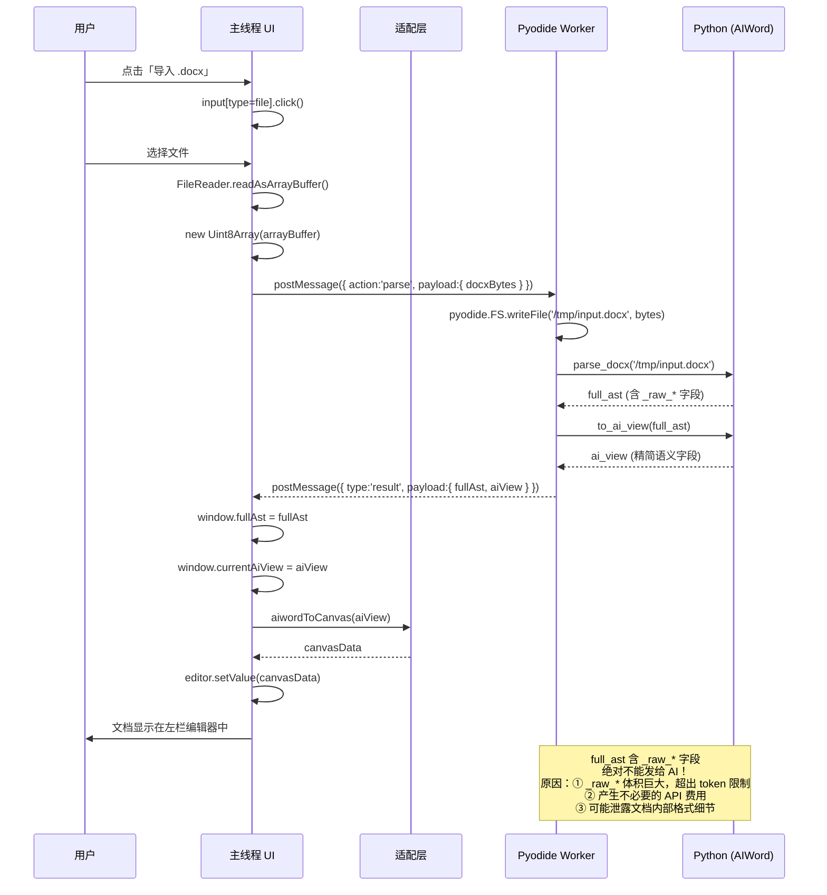
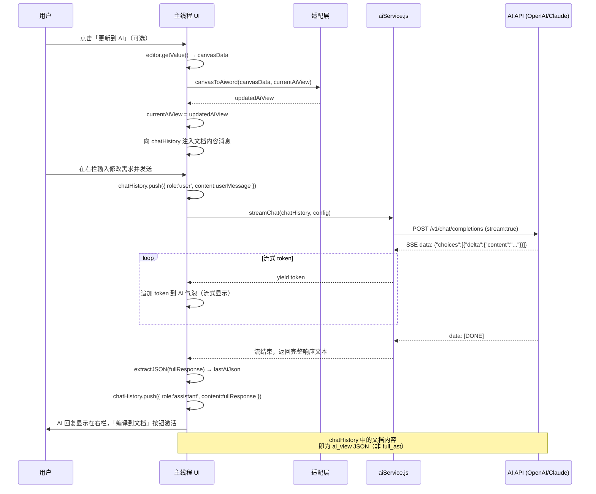
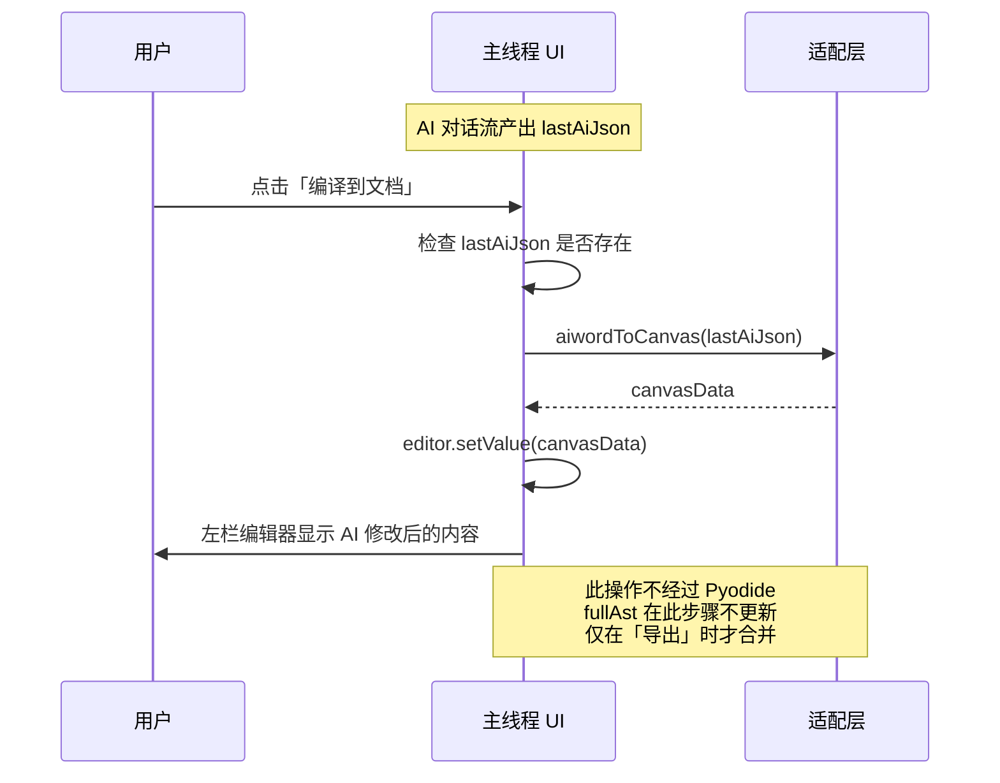
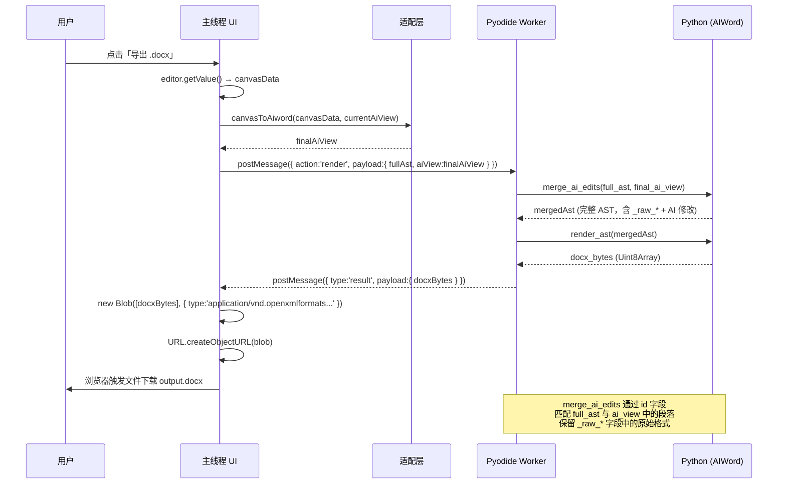
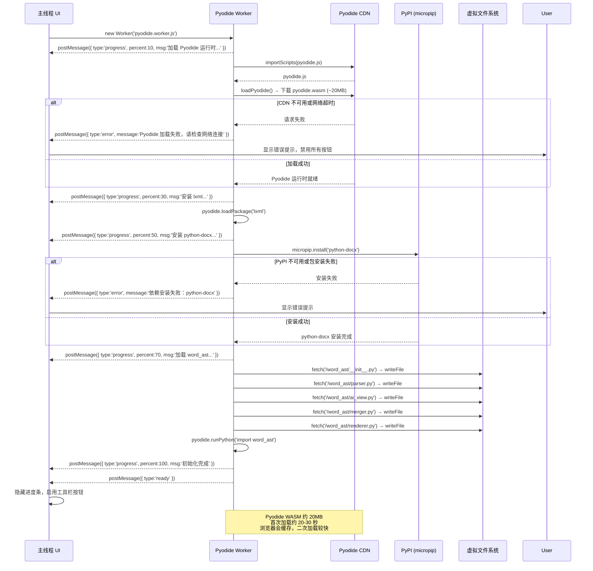
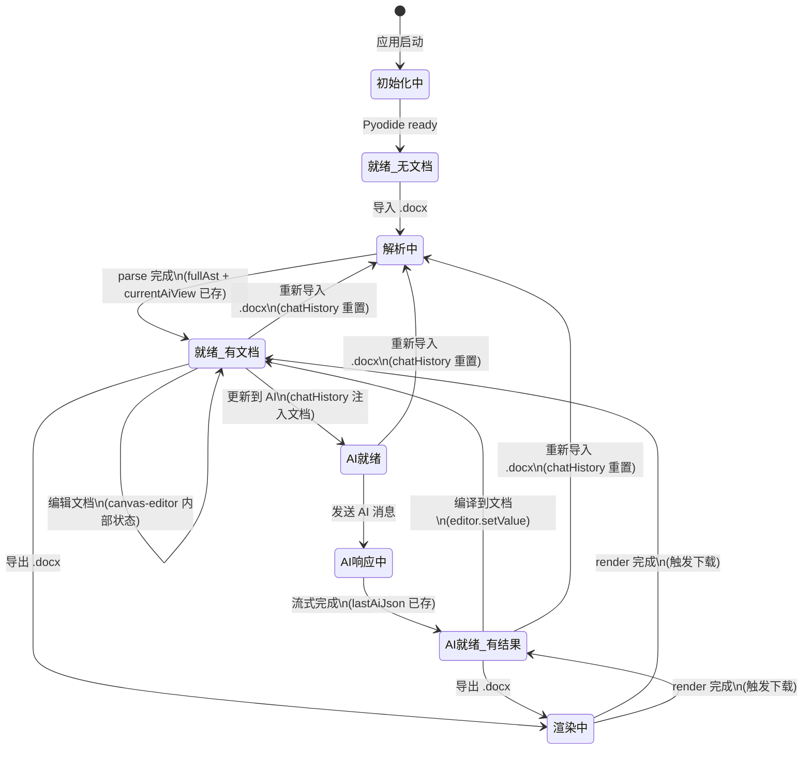

# WebAIWord 完整数据流图

> 本文档用 Mermaid 图表详细展示 WebAIWord 的完整数据流，包含文档处理流和 AI 对话流，以及两者的交汇点。

---

## 目录

1. [系统总体数据流](#1-系统总体数据流)
2. [文档处理流：导入 .docx](#2-文档处理流导入-docx)
3. [AI 对话流：发送消息](#3-ai-对话流发送消息)
4. [数据交汇：编译到文档](#4-数据交汇编译到文档)
5. [文档处理流：导出 .docx](#5-文档处理流导出-docx)
6. [Pyodide 初始化流](#6-pyodide-初始化流)
7. [状态流转图](#7-状态流转图)
8. [待办 / TODO](#8-待办--todo)

---

## 1. 系统总体数据流

---

## 2. 文档处理流：导入 .docx

---

## 3. AI 对话流：发送消息

---

## 4. 数据交汇：编译到文档

**编译到文档**是文档处理流与 AI 对话流的交汇点：AI 返回的 JSON 通过适配层渲染到编辑器。

---

## 5. 文档处理流：导出 .docx

---

## 6. Pyodide 初始化流

---

## 7. 状态流转图

下图展示 WebAIWord 全局状态在各操作中的变化：

---

## 8. 待办 / TODO

- [ ] **表格数据流**：`type: "Table"` 块从 ai_view → canvas-editor 的详细流程图
- [ ] **图片数据流**：图片二进制数据在 Worker ↔ 主线程之间的传递方式
- [ ] **错误处理流**：Pyodide 异常、AI API 限流、JSON 解析失败等异常路径
- [ ] **Service Worker 缓存流**：Pyodide WASM 的离线缓存策略
- [ ] **段落级 diff 流**：AI 仅修改部分段落时，如何最小化 merge_ai_edits 的改动范围
